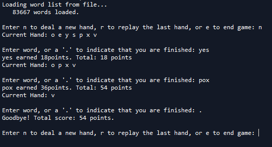
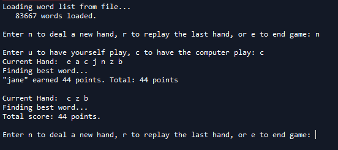

# WordsWithFriends
Python implementation of the popular word game "Words with Friends"

- To play by yourself, feel free to run either UserWWF.py or CompWWF.py
- To play against the computer, run CompWWF.py
- TestWWF.py is merely a test file to ensure that the files run correctly and produce expected results

UserWWF.py
- Loads a dictionary of 83000+ words
- Prompts the user to start a new hand, replay previous hand or end game
- Provides the user with a list of 7 characters (Number of characters provided can be adjusted by altering the value for the HAND_SIZE variable near the top of the program)
- With each valid guess of an accurate word, user gets awarded a certain number of points
- After each turn, user has the option to input more words that can be formed with the remaining letters, or get a final score

CompWWF.py
- Has all of the functionality of UserWWF.py with the additional option of playing against the computer
- At the offset of the program, user is given the option to play themselves or have the computer play a hand
- If user is playing by themselves, then the same functionality as UserWWF.py applies
- If the computer is to play a hand, then the computer provides the combination of words that produce the highest total score per turn

TestWWF.py
- Simply runs a series of test on UserWWF.py to ensure the program works as expected

